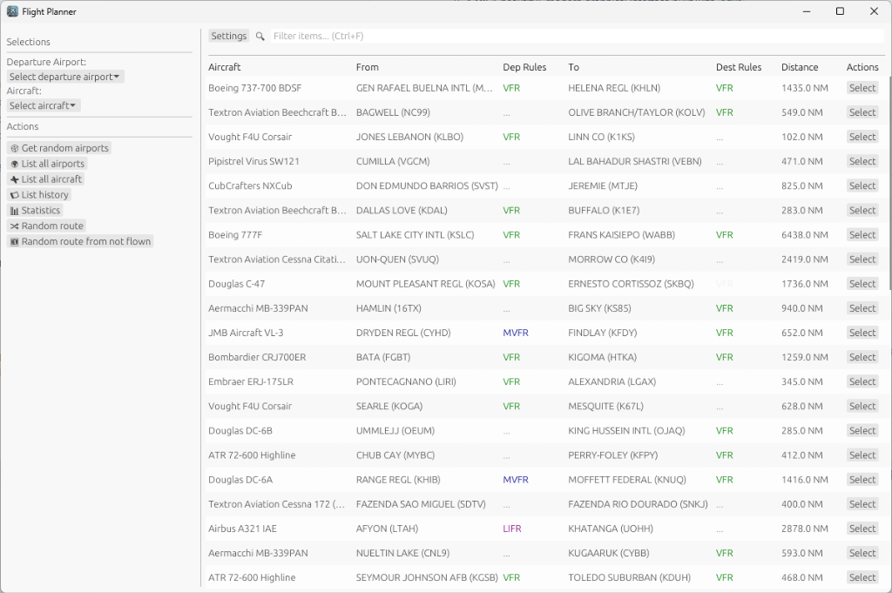

# Flight Planner

[](https://github.com/daanbouwman19/flight-planner/actions/workflows/coverage.yml)
[](https://github.com/daanbouwman19/flight-planner/blob/main/LICENSE)
[](https://github.com/daanbouwman19/flight-planner/releases)


**Flight Planner** is a comprehensive desktop application designed for flight simulation enthusiasts. It bridges the gap between your hangar and the open skies by generating realistic, flyable routes tailored to your specific fleet and preferences.

Whether you're looking for a quick random flight or exploring new destinations with a specific aircraft, Flight Planner ensures every route is flyable based on aircraft range and runway requirements.

---

## 🌟 Key Features

- **🎲 Random Route Generation**
  - Instantly generate routes between airports.
  - Lock a departure airport to find destinations from your current location.

- **✈️ Aircraft-Specific Routing**
  - Smart filtering finds routes that match your selected aircraft's range and performance.
  - Ensures arrival and departure runways meet takeoff and landing distance requirements.

- **🗺️ Explore New Horizons**
  - **Not-Flown Routes**: specifically target destinations you haven't visited yet with a particular airframe.
  - Discover new airports in your simulator's world.

- **💾 Database-Driven Accuracy**
  - Uses a robust SQLite database (`airports.db3`) for accurate global airport and runway data.
  - Supports imported aircraft fleets via CSV.

- **📊 Flight Tracking & Statistics**
  - Automatically logs your generated flights.
  - Visualize your progress with statistics on total distance, favorite aircraft, and most visited airports.

- **💻 Dual Interfaces**
  - **GUI**: A beautiful, modern graphical interface built with `egui`.
  - **CLI**: A lightning-fast command-line tool for quick generation and scripting.

---

## 📸 Screenshots

<p align="center">
  
</p>

---

## 🚀 Installation

### For Users

The easiest way to get started is to download the latest pre-built installer for your operating system.

1.  **Download**: Go to the [**GitHub Releases**](https://github.com/daanbouwman19/flight-planner/releases) page.
2.  **Install**: Run the installer for Windows, macOS, or Linux.
3.  **Setup Data Files**:
    - **Airports Database**: You must provide an `airports.db3` file (extracted from your sim). Place it in your data folder:
      - **Windows**: `%APPDATA%\FlightPlanner\`
      - **Linux**: `~/.local/share/flight-planner/`
      - **macOS**: `~/Library/Application Support/flight-planner/`
    - **Aircraft Fleet**: (Optional) Place your `aircrafts.csv` in the same directory to import your fleet. The CSV file should have the following columns: `manufacturer`, `variant`, `icao_code`, `flown`, `aircraft_range`, `category`, `cruise_speed`, `date_flown`, `takeoff_distance`.

### For Developers

If you want to contribute or build from source:

1.  **Prerequisites**: Install the [Rust toolchain](https://www.rust-lang.org/).
2.  **Clone**:
    ```bash
    git clone https://github.com/daanbouwman19/flight-planner.git
    cd flight-planner
    ```
3.  **Dev Data**: Place `airports.db3` in the project root for development.
4.  **Run**:

    ```bash
    # Run the GUI
    cargo run

    # Run the CLI
    cargo run -- --cli
    ```

---

## 📄 License

This project is licensed under the MIT License - see the [LICENSE](LICENSE) file for details.
